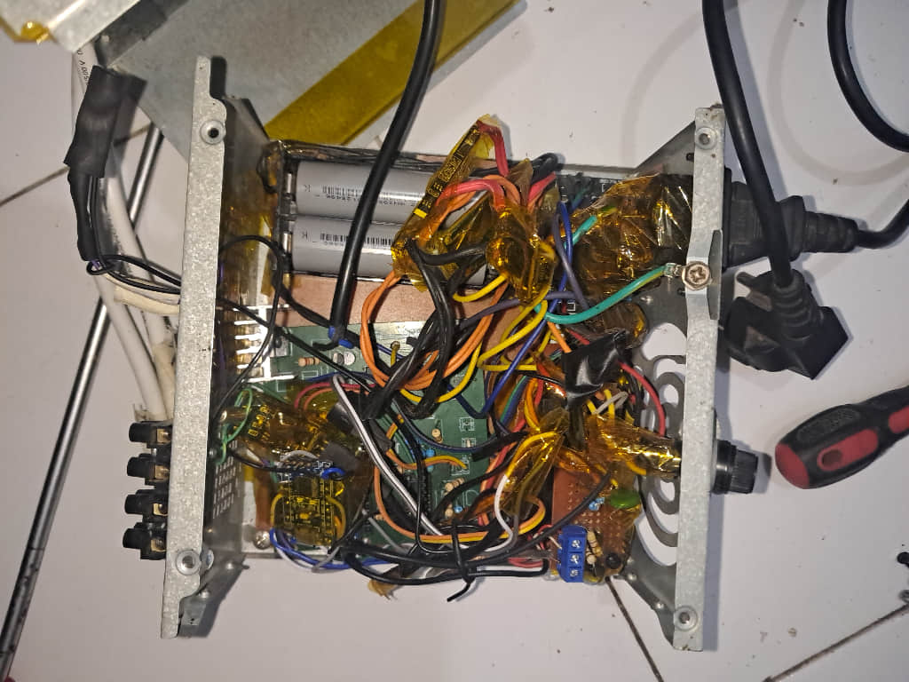
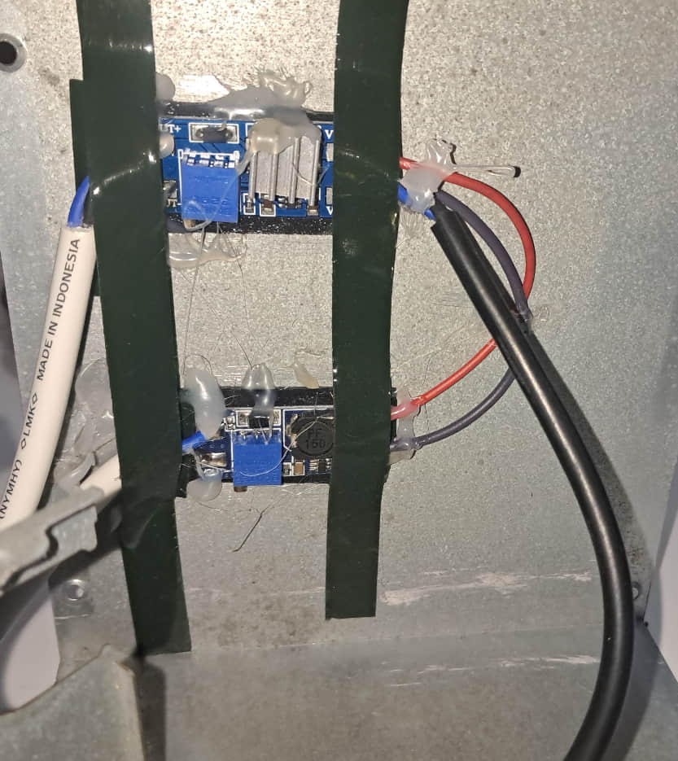
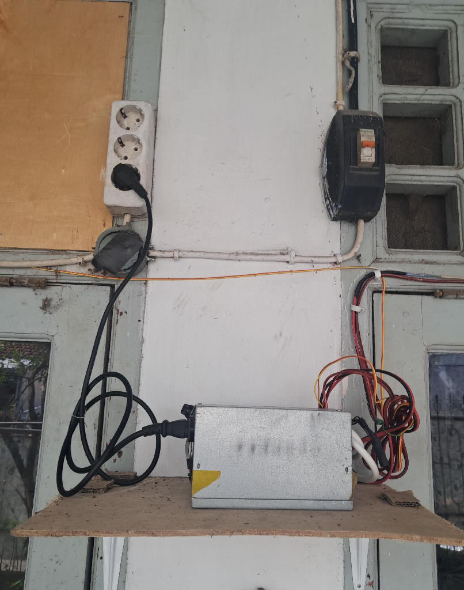
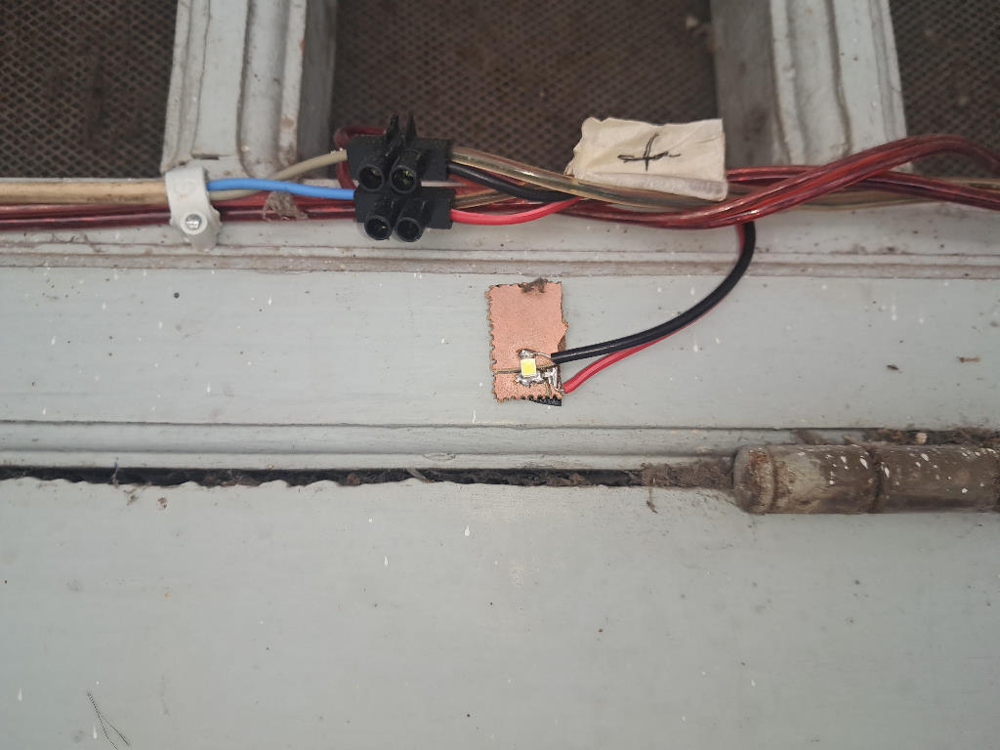

# Undens Lampu Emergency

This repository contains the source code for build a Emergency lamp based STM8 or ESP8266.

* Note: ESP8266 version are __not recommended__ but you can build it, but beware it sometimes crash and heating up when using step-up ic / module at low battery level (below 3V)

# Reason?

In my country there is much earthquake, well because i'm life in ring of fire area, i did experience big earthquake back in 2017. When earthquake happen, my family still sleeping (it around 12AM) and got blackout, there is no way to find door or find a place to protect our selfes because it's too dark to see. So that's why i make this in case it happen again we still got light to find exit or place to protect out selfes.

Most commercial emergency lamp in here are bad because cheap battery (only last 1 year and only hold 1.5h every running) and didn't have protection charger!!

# What version i should make?

There is 2 build exist (ESP8266 and STM8, arduino series will added later) for 1 layer recommended use v1.2 and for 2 layers smd build use v1.3

each folder contains how to build it. You need Android IDE to program it (in STM8 case, make sure your username in PC doesn't have "space" otherwise SDCPP will fail to build because this bug not yet fixed from SDCC it self).

* Note : For step-up ic/module you can find by self, depend of budget, because MOSFET output only act as "switch" so you need step-up to make sure it can output high voltage to light a leds (5v are common but waste much power, i recommended use 4.3v output to reduce power usage)
* MOSFET should be withstand around ~4A continues with heatsink, so if you using step-up and output set 4.3v it should be around ~4A Max in input side
* In my case only use 1A at MOSFET output and 4400mA battery. it can run without issue around 4H with 20 leds (~30mA/leds) in 12 places at home.

## Finished device:

|                      **Main device**                          |                                      **A Step up ic MT3608**                                   |
| :-----------------------------------------------------------: | :--------------------------------------------------------------------------------------------: |
|                       |                                                         |

|               **Main device when running**                    |                  **A led that used, smd led 3v with 5v input (with 47ohm resistor)**           |
| :-----------------------------------------------------------: | :--------------------------------------------------------------------------------------------: |
|          |  |

